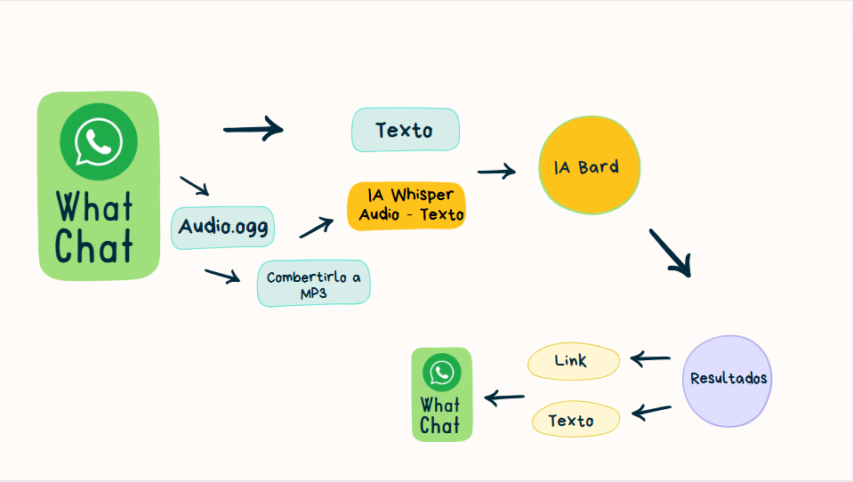

# What-Chat

La combinación de dos tecnologías que nos permite realizar consultas a través de WhatsApp, brindando la posibilidad de acceder a información en internet de manera rápida y sencilla, incluso para aquellos estudiantes o personas que no disponen de una conexión a internet de alta velocidad. Esto permite realizar consultas puntuales y obtener respuestas de forma conveniente.

//Python

    Windows
        1. Entono Virtual en la carperta /IA_whisper
        2. # pip install virtualenv
        3. # virtualenv env
        4. # pip install git+https://github.com/openai/whisper.git
        5. En el codigo debes tener selecionado el modelo que prefieres

        Instalar windows ffmpeg
        1. https://www.youtube.com/watch?v=IECI72XEox0 https://github.com/BtbN/FFmpeg-Builds/releases

        Instalar Linux ffmpeg
        1. # sudo apt update && sudo apt install ffmpeg

// Node

    1. npm i fluent-ffmpeg
    2. npm i node-google-translate-skidz
    3. npm i qrcode-terminal